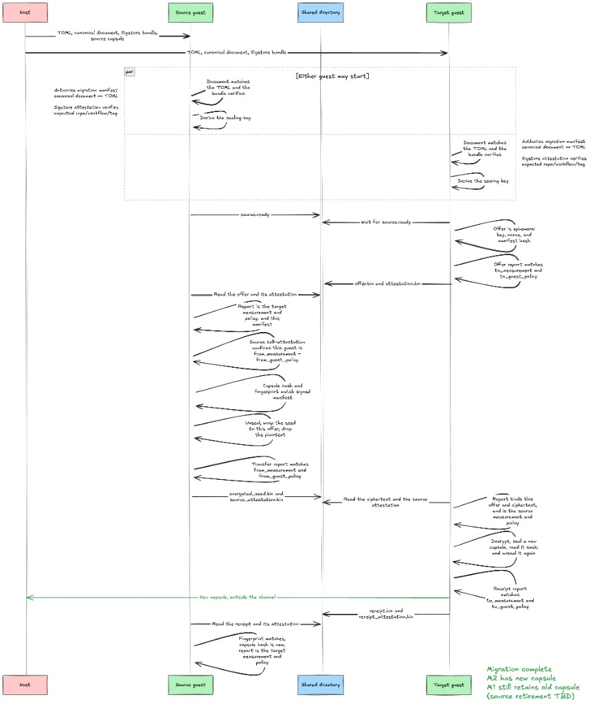

# zns-migrate

One-shot move of a sealed ZNS seed from the guest that holds it (`source`) to the next measured guest (`target`).

Both guests read the same three files, mounted from the host. They then talk to each other through one shared directory.

## Files from the host

`--manifest` is the upgrade TOML. It names the current measurement (`from_measurement`) and guest policy (`from_guest_policy`), the next measurement (`to_measurement`) and guest policy (`to_guest_policy`), the ZIP-32 seed fingerprint, the BLAKE2b-256 of the source capsule file, the SHA-256 of the new initrd, and the release tag. `release` must be the `v*` tag that workflow ran on, such as `v0.1.2`. People read this file. Guest policies are TOML integers, so `0x30000` is the usual form.

`--upgrade-document` is the canonical form of those same fields, packed as bytes. This is the file the `zns-deployment` release workflow attests. The bytes are version, sequence, both measurements, both guest policies, the seed fingerprint, the source capsule hash, the artifact hash, and the release name.

`--attestation-bundle` is the Sigstore bundle from that release, downloaded with `gh attestation download`. It proves `.github/workflows/release.yml` in `zns-deployment` attested the canonical document.

Before either guest derives a sealing key, the canonical document must match the TOML, and the bundle must verify. A change to `to_measurement` in the TOML no longer matches the bundle, so the migration stops.

## The shared directory

`--transport-dir` is only the channel between the two guests. Both can write there, so nothing in it authorizes the move. Use a fresh directory for each attempt. The three files above, and both capsules, stay outside it.

```text
source.ready
offer.bin
attestation.bin
encrypted_seed.bin
source_attestation.bin
receipt.bin
receipt_attestation.bin
```

## Run

Either side may start first. Target waits until source writes `source.ready`.

```bash
# Next guest, the one that will hold the new capsule
zns-migrate target \
  --manifest /state/upgrade.toml \
  --upgrade-document /state/upgrade.bin \
  --attestation-bundle /state/upgrade.bundle.jsonl \
  --transport-dir /migration \
  --output-capsule /state/keys/zns_seed.capsule

# Current guest, the one that holds the capsule
zns-migrate source \
  --manifest /state/upgrade.toml \
  --upgrade-document /state/upgrade.bin \
  --attestation-bundle /state/upgrade.bundle.jsonl \
  --transport-dir /migration \
  --input-capsule /state/keys/zns_seed.capsule
```



Target publishes an X25519 offer and an SNP report over that offer. Source checks that report's measurement against `to_measurement` and its guest policy against `to_guest_policy`. It then checks its own measurement and guest policy against `from_measurement` and `from_guest_policy`, and checks that the capsule file hash and header fingerprint are the ones named in the manifest. Only then does it unwrap the seed. It encrypts the seed to the target key and publishes a second report over the offer and the ciphertext.

Target decrypts only when that report matches, its measurement is `from_measurement`, and its guest policy is `from_guest_policy`. It seals a new capsule, reads that file back, and unseals it again. The receipt and a report over the receipt are written only when the reopened seed matches. Source accepts the receipt only when that report matches, its measurement is `to_measurement`, and its guest policy is `to_guest_policy`.

Target leaves an existing capsule in place unless `--replace-after-verified-migration` is set. Source leaves its original capsule on disk after it exits. A finished run copies the seed: both guests can still unseal it. Retiring the source capsule is not done yet.

The attested manifest includes `sequence`. This binary does not compare it with a stored custody generation, so an older attested manifest for the same source measurement is still accepted.

## Build

`zns-canon` supplies sealing, capsule parsing, the manifest hash, migration `report_data`, the offer-bound X25519 seed wrap, stored SNP report verification, and `authorize_manifest`. Sealing and attestation use the SNP guest device. There is no off-enclave build.

The receipt checks and the source, transfer, and receipt reports stay in this binary.
